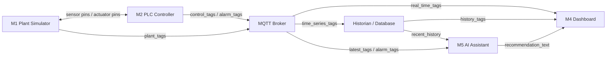
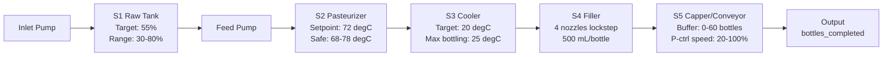

# Smart Beverage Pasteurization and Bottling Line Digital Twin

This repository contains a digital twin of a smart beverage pasteurization and bottling line. The system is organized like an RTL-style modular design: each module has clear input pins, output pins, and a defined responsibility.

> **TUMA206 Group 1 — V4 Final.** A pure-Python implementation of the 5-module architecture.
> Three-page professional dashboard: SCHEMATIC (process flow), TRENDS (real-time charts), ALARMS (AI diagnostics).
> All actuators use proportional 0-100% control with per-actuator manual override. Fault detection runs always — safety is never bypassed.

## Quick start

```bash
pip install -r requirements.txt
streamlit run dashboard/app.py
```

Press **START**, watch the process flow diagram update live. Inject faults from the sidebar or toggle per-actuator manual override to test alarm responses. No API key or MQTT broker required. For Claude-powered AI diagnostics, enter your `ANTHROPIC_API_KEY` in the ALARMS page sidebar (no restart needed). Terminal smoke test: `python run.py --ticks 30`.

## V4 Improvements (relative to V3)

### Bottling Physics Redesign

| Area | V3 | V4 |
|------|----|----|
| Filler model | 4-lane discrete event (per-lane timer, sequential load) | **Inline monoblock: all 4 nozzles fill in lockstep on one carrier** |
| Fill timing | Fixed `FILL_DURATION_TICKS=3` (flow-independent) | **Flow-driven**: fill fraction per tick = `flow_rate × UPDATE_PERIOD_S / (FILL_VOLUME_ML × FILL_NOZZLES)` |
| Filler state | Per-lane `fill_timer` / `lane_filled` booleans | **Phase machine**: INDEX (1-tick transfer dead-time) → FILL (progress 0..1) → batch discharge |
| Conveyor | Discrete counter, discharge interval fixed | **Continuous accumulation buffer** (float): grows when filler outpaces belt, drains when belt outpaces filler |
| Conveyor speed | Mechanically linked to fill cycle | **P-controller on buffer level**: `cmd = clamp(40 + 6×(buffer − 12), 20, 100)` — visibly responds to any speed mismatch |
| Conveyor capacity | 48 bottles | **60 bottles** |
| Throughput readout | `fill_lanes` / `fill_lane_filled` arrays | `nozzle_status` (0=idle, 1=filling, 2=full), `fill_phase`, `fill_progress` (0..1) |

### Dashboard Updates

| Area | V3 | V4 |
|------|----|----|
| ALARMS theme | Warm brown/cream (inconsistent) | **Dark industrial** — matches SCHEMATIC + TRENDS |
| AI API key | Set via `.env` file / env var only, requires restart | **In-UI input** on ALARMS sidebar — hot-swap without restart |
| Filler display | Per-lane colored dots (L1/L2/L3/L4) | **Nozzle status dots + fill phase + ASCII progress bar** |
| S4 stage card | Referenced old `FILL_DURATION_TICKS` | **Live phase/progress** display |
| S5 stage card | Referenced old `BOTTLE_CYCLE_TICKS` | **Buffer target + discharge rate** from config |

### Architecture
| Area | V2 | V3 |
|------|----|----|
| Actuator control | Mixed binary (on/off) + float | **All proportional 0-100%** (inlet valve, pump, heater, cooling, conveyor) |
| Manual override | Global auto/manual toggle | **Per-actuator independent override** — PLC adapts remaining auto actuators |
| Manual→auto transition | Jump to preset value | **Smooth gradient recovery** — accumulator stays at manual value, auto converges within 3 ticks; debounce counters reset to prevent false FAULT |
| Slider init on manual check | Always starts at 0% | **Starts from current auto value** — snapshots live engine value when checkbox is first ticked |
| Fault detection | TEMP_OUT_OF_RANGE skipped when heater manual | **All faults detected always** — safety never bypassed |
| Thermal model | Fast response (0.20/0.25 time constant, ±0.08 noise) | **Industrial inertia** (0.05/0.08 time constant, ±0.02 noise) — realistic slow heating/cooling, smooth trend curves |
| Heater/Cooler control | Simple integral + clamping (windup, oscillation) | **PI with anti-windup + tuned gains** — Kp=1.5 (smooth, no sawtooth) |
| Filler model | Single fill head | **4-lane rotary filler** — parallel heads with individual detection/fill/done states |
| Tank level alarm | None | **TANK_OVERFLOW (90%) + TANK_EMPTY (15%)** — early warning before physical limits; priority above temp/pump faults |
| Conveyor model | Bottle count only | **Queue model** — bottles enter belt, exit via independent discharge timer. `bottles_completed` output counter, max capacity **48** |
| Cooler physics | Mixing/blending model (incorrect for HX) | **Rate-scaling model** (physically correct): cooling rate ∝ valve opening, target always 20°C |
| Fault priority | TEMP > PUMP > SENSOR | **TANK > TEMP > PUMP > SENSOR** — physical safety hazards first |
| Fill valve safety | Stays open if bottle departs mid-fill | **Closes immediately** when bottle_present goes low |
| Heater gain | Adapted only for manual pump | **Adapts to actual flow_rate** in all modes: gain 1.0/1.5/2.5 at low/med/high flow |
| PUMP_FAIL guard | Bottles loaded with no product | **Returns early** if flow_rate < 1.0 and no active fill — prevents dry bottling |
| Flow→Fill→Conveyor link | Fixed timings (3t fill, 6t cycle) | **Dynamic chain**: pump speed → flow rate → fill duration (2-8t) → conveyor speed (25-100%) |
| Fast recovery | Manual offsets | Proportional reset on FAULT clear; pump pre-charged at 70% on START |

### Dashboard
| Area | V2 | V3 |
|------|----|----|
| Pages | 3 pages with emoji titles | **st.navigation()** with clean uppercase labels: SCHEMATIC / TRENDS / ALARMS |
| P&ID Schematic | Hand-coded raw SVG (misaligned, legend, fragile) | **CSS Grid equipment cards** — dark industrial theme, bottom-up tank fill, status glows, no legend |
| Theme | Warm brown/cream industrial | **Dark tech theme** (`#0d1117` base) with green/orange/red status coding |
| Button feedback | None | **CSS :active press effect + ripple + toast confirmation** |
| START behavior | Starts line, keeps manual overrides | **Clears all manuals → full AUTO mode** |
| Manual sidebar order | Feed Pump first | **Inlet Valve → Feed Pump → Heater → Cooling → Conveyor** (process order) |
| Trends page | KeyError on cooler_temp chart; zoom reset on refresh | Fixed: `cooler_temp` + `cooling_valve_cmd` added to historian columns. **Per-chart FREEZE/UNFREEZE** — snapshots dataframe, zoom/pan preserved while data accumulates |
| Trends data | IDLE rows mixed in causing vertical cliffs | **Filtered out** — only RUNNING/STARTING/FAULT states plotted. Fixed y-axis ranges prevent micro-fluctuation amplification |
| Filler display | Single head count | **4-lane status lights** — per-lane indicator row: ● blue=FILLING, ● green=DONE, ○ gray=IDLE |

### Code Quality
| Area | V2 | V3 |
|------|----|----|
| `_clamp()` | Duplicated in plant.py + controller.py | **Single definition in config.py**, imported by both |
| `run.py` | Duplicated in `ai_assistant/` | **Removed duplicate** |
| AI cache | Keyed only on alarm_code (stale diagnoses) | **Sensor fingerprint** `{temp}_{level}_{flow}` in cache key |
| `UPDATE_PERIOD_S` | Unused | Removed from control flow references |
| Unused constants | `STAGE_NAMES` defined but never imported | Cleaned up |

## Technology stack

| Layer | Tool | Module |
|---|---|---|
| Frontend (dashboard) | Streamlit + Plotly + CSS Grid | M4 |
| Backend | Python (FastAPI) + paho-mqtt | engine + M3 |
| Database | SQLite + CSV export | M3 historian |
| LLM model + provider | Claude Sonnet + Anthropic API | M5 |
| Agent framework | Claude Agent SDK / custom Python loop | M5 |

## System Assumption

| Item | Value |
|---|---|
| System state update period | 1 s |

## Top-Level Architecture



Key rule: the closed-loop control path is only between **M1 Plant Simulator** and **M2 PLC Controller**. The AI assistant recommends operator actions but does not directly control actuators.

## Module Summary

| Module | Main input pins | Main output pins | Responsibility |
|---|---|---|---|
| M1 Plant Simulator | `actuator_cmd_*`, `fault_inject_code`, `reset_fault` | `sensor_*`, `feedback_*`, `stage_state`, `fault_status`, `conveyor_queue` | Simulate the physical beverage line and fault behavior. |
| M2 PLC Controller | `sensor_*`, `feedback_*`, `operator_start`, `operator_stop`, `manual_overrides` | `actuator_cmd_*`, `alarm_code`, `plc_state` | Run control logic, state machine, fault detection. Adapts auto actuators around manual overrides. |
| M3 Data Layer | `plant_tags`, `control_tags`, `alarm_tags` | `real_time_tags`, `history_tags`, `data_stale_flag` | Transfer tags through MQTT and store history in SQLite. |
| M4 Dashboard | `real_time_tags`, `history_tags`, `recommendation_text` | `operator_start`, `operator_stop`, `fault_inject_code`, `reset_fault`, `manual_overrides` | Three-page professional UI: SCHEMATIC (P&ID + KPIs), TRENDS (charts), ALARMS (AI + event log). |
| M5 AI Assistant | `latest_tags`, `alarm_code`, `recent_history` | `recommendation_text`, `diagnosis_label`, `confidence_level` | Explain alarms and recommend operator actions. Claude API or rule-based fallback. |

## M1 Plant Simulator Port Specification

```text
module M1_PlantSimulator (
    input  pump_cmd,              // 0-100% proportional
    input  inlet_valve_cmd,       // 0-100% proportional
    input  heater_power_cmd,      // 0-100% proportional
    input  cooling_valve_cmd,     // 0-100% proportional
    input  conveyor_cmd,          // 0-100% proportional
    input  fill_valve_cmd,        // 0/1 binary (timer-controlled)
    input  capper_cmd,            // 0/1 binary
    input  fault_inject_code,
    input  reset_fault,
    output tank_level,
    output pasteur_temp,
    output cooler_temp,
    output flow_rate,
    output bottle_present,
    output bottle_count,
    output bottles_completed,     // bottles that exited the conveyor (finished production)
    output conveyor_queue,        // bottles currently on belt
    output conveyor_max,          // max belt capacity (60)
    output pump_feedback,
    output valve_feedback,
    output stage_state,
    output fault_status,
    output fill_phase,            // "INDEX" or "FILL"
    output fill_progress,         // 0.0-1.0 carrier fill fraction
    output nozzle_status          // [0..3]: 0=idle, 1=filling, 2=full
);
```

## M2 PLC Controller Port Specification

```text
module M2_PLCController (
    input  tank_level,
    input  pasteur_temp,
    input  cooler_temp,
    input  flow_rate,
    input  bottle_present,
    input  pump_feedback,
    input  valve_feedback,
    input  operator_start,
    input  operator_stop,
    input  manual_overrides,      // {actuator: value} for per-actuator manual control
    output pump_cmd,              // 0-100%
    output inlet_valve_cmd,       // 0-100%
    output heater_power_cmd,      // 0-100%
    output cooling_valve_cmd,     // 0-100%
    output conveyor_cmd,          // 0-100%
    output fill_valve_cmd,        // 0/1
    output capper_cmd,            // 0/1
    output alarm_code,
    output plc_state
);
```

## Pipeline (5 Stages)



## Control Strategies

| Stage | Method | Details |
|---|---|---|
| S1 Inlet Valve | Proportional (P) | Target 55%, gain=2.0 (smooth, no oscillation). Full open at <=30%, full close at >=80% |
| S1 Feed Pump | Proportional (P) | Speed proportional to tank level: 30% at low, 100% at high. Smoothing factor 0.4 |
| S2 Pasteurizer | PI + anti-windup | Setpoint 72 degC, Kp=1.5. Gain adapts to actual flow_rate (1.0-2.5). Anti-windup: blocks only when saturated + error pushes deeper |
| S3 Cooler | PI + anti-windup | Target 20 degC, Kp=1.5. Rate-scaling physics: more valve = faster approach to 20°C |
| S4 Filler | **4-nozzle inline monoblock** | All nozzles fill in lockstep. Fill rate = `flow_rate × 1000/60 × UPDATE_PERIOD_S / (500 × 4)` fraction/tick. INDEX→FILL→discharge |
| S5 Conveyor | **P-controller on buffer level** | `cmd = clamp(40 + 6×(buffer − 12), 20, 100)`. Visibly speeds up when buffer grows, slows when buffer drains |

## Industrial Speed Chain

Real beverage lines have a tight speed dependency: the feed pump determines how much liquid is available, which directly limits how fast the 4-nozzle carrier can be filled. The conveyor P-controller then tracks the resulting buffer level autonomously.

```
FEED PUMP speed          FLOW RATE              FILL TIME (4×500mL)     CONVEYOR (auto)
    100%        →        40 L/min       →       ~3 ticks/carrier  →     P-ctrl ~60-80%
     68%        →        27 L/min       →       ~4-5 ticks        →     P-ctrl ~40-60%
     50%        →        20 L/min       →       ~6 ticks          →     P-ctrl ~20-40%
```

The 4-nozzle inline monoblock filler cycle:
1. INDEX phase (1 tick): empty carrier indexes into the fill station
2. FILL phase: all 4 nozzles dispense simultaneously. Progress = `flow × dt / (500 × 4)` per tick
3. Carrier full (progress ≥ 1.0): 4 bottles discharged into the accumulation buffer as a batch
4. Conveyor P-controller removes bottles from the buffer at a rate proportional to belt speed
5. Dashboard shows per-nozzle status (IDLE/FILLING/FULL) + fill progress bar in real time


## Fault Injection and Alarm Codes

| Code | Fault | Alarm | Debounce | Effect |
|------|-------|-------|----------|--------|
| 0 | Normal | No alarm (0) | — | Normal operation |
| 1 | Temperature sensor stuck | SENSOR_TEMP_STUCK (10) | 3 ticks | pasteur_temp frozen → FAULT, all outputs=0 |
| 2 | Feed pump failure | PUMP_NO_FLOW (20) | 3 ticks | pump on but no flow/feedback → FAULT |
| 3 | Temperature excursion | TEMP_OUT_OF_RANGE (30) | 3 ticks | temp outside 68-78 degC after warm-up → FAULT; auto-clears when back in range |
| 4 | Data link stale | DATA_STALE (40) | Instant | tags frozen, dashboard shows last values |
| — | Tank >90% | TANK_OVERFLOW (50) | 3 ticks | Overflow risk → FAULT (highest priority after DATA_STALE) |
| — | Tank <15% | TANK_EMPTY (51) | 3 ticks | Dry-run risk → FAULT (above MIN_PUMP=10%, early warning) |

## Conveyor Output Model

Bottles flow through S5 in three stages tracked by separate counters:

| Counter | Meaning | When Incremented |
|---------|---------|-----------------|
| `bottle_count` | Total bottles capped (entered conveyor) | On capping |
| `conveyor_queue` | Bottles currently on the belt (0-24) | +1 on capping, -1 on discharge |
| `bottles_completed` | Finished bottles that exited the line | On discharge from belt |

Discharge uses an independent timer (not coupled to the bottle station cycle):
- At 100% conveyor: 1 bottle exits every `BOTTLE_CYCLE_TICKS` (6) ticks
- At 50% conveyor: 1 bottle exits every 12 ticks
- Queue full (24 bottles) → upstream capping pauses until space frees

### Manual-Override Induced Faults

Any actuator set to manual can cause process faults — fault detection runs ALWAYS:
- Inlet valve 100% + pump 0% → tank fills past 95% → TANK_OVERFLOW
- Inlet valve 0% + pump 100% → tank drains below 5% → TANK_EMPTY
- Heater 0% or 100% → temperature leaves 68-78 degC → TEMP_OUT_OF_RANGE
- Pump manual + pump failure injection → PUMP_NO_FLOW

## PLC State Machine

```
IDLE ──[START]──> STARTING ──[1 tick]──> RUNNING ──[serious alarm]──> FAULT
  ^                  ^                      |                            |
  |                  |                      [STOP]                       |
  |                  |                      v                            |
  └────[STOP]────────┴────────────────── STOPPING ──[1 tick]──> IDLE <──┘
                                                                    (acknowledge)
```

## Repository Structure

```text
README.md
config.py               # All constants, setpoints, fault/alarm codes, clamp()
simulator/plant.py      # M1 — physics + conveyor queue model
plc/controller.py       # M2 — PI control + anti-windup + 6 alarm detectors
engine/runtime.py       # Closed-loop wire-up + background thread
messaging/bus.py        # M3a — InProcessBus / MqttBus
historian/store.py      # M3b — SQLite + CSV export
ai_assistant/assistant.py  # M5 — Claude API + rule-based fallback (7 alarm types)
dashboard/
  app.py                # Navigation hub (st.navigation)
  SCHEMATIC.py          # Page 0 — P&ID process flow + stage cards + KPIs
  pages/
    1_Trends.py         # Page 1 — 2x2 sensor charts + actuator charts
    2_Alarms.py         # Page 2 — AI diagnosis + alarm event log
backend/api.py          # FastAPI REST + WebSocket (optional)
run.py                  # CLI smoke test
requirements.txt
```

## Key Configuration Values

| Constant | Value | Meaning |
|----------|-------|---------|
| TANK_LEVEL_TARGET | 55% | Tank level setpoint |
| TANK_LEVEL_LOW / HIGH | 30% / 80% | Inlet valve full open / full close |
| TANK_LEVEL_MIN_PUMP | 10% | Pump dry-run guard |
| TANK_CRITICAL_HIGH / LOW | 90% / 15% | Overflow / empty alarm thresholds |
| PASTEUR_SETPOINT | 72 degC | Pasteurization target |
| PASTEUR_SAFE_MIN / MAX | 68 / 78 degC | Safe temperature band |
| COOLER_SETPOINT | 20 degC | Cooling target (rate-scaling model) |
| COOLER_MAX_BOTTLING | 25 degC | No bottling above this |
| FILL_NOZZLES | 4 | Parallel nozzles filling in lockstep |
| FILL_VOLUME_ML | 500 mL | Nominal bottle size |
| FILL_GAP_TICKS | 1 | Index/transfer dead-time between carriers |
| CONVEYOR_MAX_BOTTLES | 60 | Buffer belt capacity |
| CONVEYOR_TARGET_BUFFER | 12 | P-controller buffer setpoint |
| CONVEYOR_BOTTLES_PER_TICK_AT_100 | 1.5 | Discharge throughput at 100% speed |
| ALARM_DEBOUNCE_TICKS | 3 | Consecutive abnormal ticks to latch alarm |

## Demo Plan

1. Run `streamlit run dashboard/app.py`
2. Press **START** — line ramps up: tank reaches 50%, pasteurizer reaches 72 degC, bottles begin capping
3. SCHEMATIC page shows live process flow with colored equipment cards and stage detail panels
4. Switch to TRENDS page to see real-time sensor and actuator charts
5. Inject faults from sidebar:
   - `1` Temperature sensor stuck → SENSOR_TEMP_STUCK → FAULT, AI diagnoses
   - `2` Feed pump failure → PUMP_NO_FLOW → FAULT
   - `3` Temperature excursion → TEMP_OUT_OF_RANGE → FAULT (auto-clears on recovery)
   - `4` Data link stale → DATA_STALE → dashboard freezes
6. Toggle per-actuator manual override:
   - Check any actuator → slider starts at **current auto value** (not 0%)
   - Adjust slider → actuator responds immediately
   - Uncheck → **smooth gradient return** to auto within 3 ticks (debounce counters reset)
   - Set Inlet Valve 100% + Feed Pump 0% → tank overfills → TANK_OVERFLOW
   - Set Heater 0% → temp drops → TEMP_OUT_OF_RANGE
7. Press **RESET** then **START** to recover (all manuals cleared, line restarts in full AUTO)
8. Observe SCHEMATIC page: `bottles_completed` counts finished output at S5 exit
9. Export CSV from TRENDS page for evidence (smooth curves, no sawtooth oscillation)
10. Switch to ALARMS page to review alarm event log and AI recommendations (sensor-fingerprint cache)

> Advanced: set `USE_MQTT=1` for real MQTT broker; run `uvicorn backend.api:app` for REST/WebSocket API.
