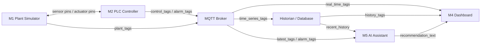

# Smart Beverage Pasteurization and Bottling Line Digital Twin

This repository contains a digital twin of a smart beverage pasteurization and bottling line. The system is organized like an RTL-style modular design: each module has clear input pins, output pins, and a defined responsibility.

> **TUMA206 Group 1 — V4 Final.** A pure-Python implementation of the 5-module architecture.
> Three-page professional dashboard: SCHEMATIC (process flow), TRENDS (real-time charts), ALARMS (AI diagnostics).
> All actuators use proportional 0-100% control with per-actuator manual override. Fault detection runs always — safety is never bypassed.

## Quick start

```bash
pip install -r requirements.txt
streamlit run dashboard/app.py
```

Press **START**, watch the process flow diagram update live. Inject faults from the sidebar or toggle per-actuator manual override to test alarm responses. No API key or MQTT broker required. For Claude-powered AI diagnostics, enter your `ANTHROPIC_API_KEY` in the ALARMS page sidebar (no restart needed). Terminal smoke test: `python run.py --ticks 30`.

## V4 Improvements (relative to V3)

### SVG P&ID Process Flow Diagram

V3 used CSS Grid text cards for the flow diagram. V4 replaces them with a professional **SVG-based industrial P&ID**:

- **7 equipment nodes** in clean horizontal pipeline: Inlet Pump (circle with rotating impeller) → Raw Tank (vertical vessel with live liquid fill) → Feed Pump (circle with rotating impeller) → Pasteurizer (heating bars with temperature glow) → Cooler (coil circles with valve-driven opacity) → Filler ×4 (4 nozzle columns with fill streams + bottle levels) → Conveyor (belt with bottle markers proportional to buffer fill)
- **Dynamic animations**: pump impellers spin when active, pipes dash-flow when product flows, heating bars pulse with heater %, fill streams blink during filling, bottle markers scroll on moving belt
- **Status-driven visuals**: green glow (normal), orange glow (warning), red glow (fault), gray idle — per equipment; manual-override equipment gets orange "M" badge
- **All data labels positioned on/near equipment** — no redundant header text, no duplicate KPI strip
- Clean single-row `viewBox="0 0 825 175"` responsive scaling

### Bottling Physics Redesign

| Area | V3 | V4 |
|------|----|----|
| Filler model | 4-lane discrete event (per-lane timer, sequential load) | **Inline monoblock: all 4 nozzles fill in lockstep on one carrier** |
| Fill timing | Fixed `FILL_DURATION_TICKS=3` (flow-independent) | **Flow-driven**: fill fraction per tick = `flow_rate × UPDATE_PERIOD_S / (FILL_VOLUME_ML × FILL_NOZZLES)` |
| Filler state | Per-lane `fill_timer` / `lane_filled` booleans | **Phase machine**: INDEX (1-tick transfer dead-time) → FILL (progress 0..1) → batch discharge |
| Conveyor | Discrete counter, discharge interval fixed | **Continuous accumulation buffer** (float): grows when filler outpaces belt, drains when belt outpaces filler |
| Conveyor speed | Mechanically linked to fill cycle | **P-controller on buffer level**: `cmd = clamp(40 + 6×(buffer − 12), 20, 100)` — visibly responds to any speed mismatch |
| Conveyor capacity | 48 bottles | **60 bottles** |
| Throughput readout | `fill_lanes` / `fill_lane_filled` arrays | `nozzle_status` (0=idle, 1=filling, 2=full), `fill_phase`, `fill_progress` (0..1) |

### Cooler Physics — Pipe Transit + HX with Full Valve Authority

V3's cooler had no pipe transit model and near-invisible active cooling. V4 models the complete thermal path with **full valve authority** — the operator can drive temperature across a wide range:

| Valve % | Steady-state temp | Effect |
|---------|-------------------|--------|
| 0% (off) | ~53°C | Approaches pipe inlet temp — product dangerously hot |
| 5-10% | ~31-33°C | Above bottling limit → **COOLER_HIGH alarm at 32°C** |
| 43-50% (AUTO) | **25°C** | PI controller maintains setpoint — clearly active |
| 50% | ~25°C | Manual 50% holds setpoint |
| 80-100% | ~22°C | Maximum cooling toward COOLER_FLOOR (15°C) |

| Term | Physics | Implementation |
|------|---------|----------------|
| **Pipe transit** | Product travels pasteurizer→cooler via inter-stage pipe. Walls shed ~40-50% of ΔT to ambient. Faster flow = less residency = less cooling = hotter inlet. | `pipe_temp = 72°C − 0.50×(1−0.3×flow_factor)×(72−25)` — typical inlet **50–55°C** |
| **Inlet heating** | Hot product continuously enters HX, adding heat load. Stronger effect than before. | `cooler_temp += 0.05 × flow_factor × (pipe_temp − cooler_temp)` |
| **Active cooling** | Glycol HX drives toward COOLER_FLOOR (15°C). Authority: 0.30 coefficient. | `cooler_temp += 0.30 × valve% × (15°C − cooler_temp)` |
| **COOLER_HIGH alarm** | New alarm code 53. Auto-clears when temp drops. | Triggers at 32°C after 3-tick debounce. Priority: TANK > BUFFER > **COOLER** > TEMP > PUMP > SENSOR |

| Config | V3 | V4 |
|--------|----|----|
| Cooling setpoint | 20°C | **25°C** (PI target) |
| Cooling floor | None | **15°C** (max cooling authority) |
| Max bottling | 25°C | **28°C** (fill interlock) |
| Alarm threshold | None | **32°C** (COOLER_HIGH) |
| AUTO valve at 25°C | ~0% (invisible) | **~18%** (visible, with headroom) |
| Manual low valve | No effect | **5-10% → temp >32°C → alarm** |
| Manual high valve | No effect | **80% → ~17°C** |

### Pasteurizer Thermal Model Fix

The V3 pasteurizer model only simulated heating toward a target. It lacked **flow-through cooling** — the dominant thermal disturbance in real pasteurizers where cold beverage (~25°C) continuously enters, absorbs heat, and exits. Without this load, the PI controller had no real disturbance to fight; temperature could drift over long runs.

| Area | V3 | V4 |
|------|----|----|
| Thermal load | None — temp only approaches heater target | **Flow-through cooling**: `temp −= 0.012 × flow_factor × (temp − 25°C)` — more flow = more cold mass = more cooling |
| Heater range | 25–85°C target (ΔT=60) | **25–90°C target (ΔT=65)** — sufficient headroom at full flow |
| Heater PI gain | 1.0 / 1.5 / 2.5 (3 tiers) | **1.5 / 2.0 / 3.0 / 5.0** (4 tiers, flow-adaptive) — fast disturbance rejection |
| Steady state | ~78% heater → 72°C | **~84% heater → 72.0°C** — stable across 300+ ticks, 100% in safe band |

### SVG P&ID Polish (pump rotation + filler layout)

| Area | Before | After |
|------|--------|-------|
| Pump impeller rotation | `transform-origin: center` — rotated around SVG viewport center (wrong) | **Inline pixel origin** `transform-origin: {cx}px {cy}px` — each pump rotates around its own circle center |
| Filler nozzle labels | N1–N4 at bottle bottom — overlapped with phase text | **N labels above nozzle heads** — clean separation from status line |
| Filler idle state | Always showed `INDEX` (internal phase name) even when stopped | **Shows "IDLE" when line stopped**, phase+progress only when running |

### Sequential Startup (HEAT → PRIME → RUNNING)

V3 started all actuators simultaneously on START. V4 implements a realistic **3-phase startup sequencer** that gates each stage by process readiness:

| Phase | PLC State | Inlet Valve | Heater | Pump | Filler | Conveyor | Transition Condition |
|-------|-----------|-------------|--------|------|--------|----------|---------------------|
| **HEAT** (0) | STARTING | AUTO (fill tank from 0%) | **100%** (rapid warm-up) | **OFF** | OFF | OFF | `temp ≥ 68°C` AND `cooler ≤ 28°C` AND `tank ≥ 30%` |
| **PRIME** (1) | STARTING | AUTO | AUTO (PI) | **Ramp 0→40%** | OFF | OFF | `flow > 5 L/min` |
| **RUNNING** (2) | RUNNING | AUTO | AUTO (PI) | AUTO (P) | AUTO (interlock) | AUTO (P-ctrl) | — |

Key safety features:
- Tank starts at **0%**, fills during HEAT — no TANK_EMPTY alarm until pump runs
- Pump won't start until pasteurizer+cooler temperatures are ready
- Filler won't open until product is both pasteurized AND cooled
- Conveyor P-controller activates only when bottles enter the buffer
- Manual override of any actuator bypasses the sequencer for that actuator only

### New: Buffer Overflow Alarm

Conveyor belt can now reach full capacity (60/60) when the filler outruns a slow conveyor. A new alarm protects against buffer overflow:

| Code | Alarm | Trigger | Debounce |
|------|-------|---------|----------|
| 52 | BUFFER_HIGH | `conveyor_queue ≥ 60 × 0.90` | 3 ticks |

Alarm priority: **TANK > BUFFER > COOLER > TEMP > PUMP > SENSOR** (DATA_STALE takes precedence above all).

### Dashboard Updates

| Area | V3 | V4 |
|------|----|----|
| P&ID schematic | CSS Grid text cards | **Full SVG industrial P&ID** with animated equipment, rotating pumps, bottle-fill streams |
| ALARMS theme | Warm brown/cream (inconsistent) | **Dark industrial** — matches SCHEMATIC + TRENDS |
| AI API key | Set via `.env` file / env var only, requires restart | **In-UI input** on ALARMS sidebar — hot-swap without restart |
| AI consultation | Auto-diagnosis on active alarm only | **Chat panel + 4 quick-action buttons** (Diagnose Alarm, Analyze State, Recovery Steps, Risk Check) — free-form operator questions with live context injection |
| Filler display | Per-lane colored dots (L1/L2/L3/L4) | **Nozzle status dots + fill phase + ASCII progress bar** |
| S4 stage card | Referenced old `FILL_DURATION_TICKS` | **Live phase/progress** display |
| S5 stage card | Referenced old `BOTTLE_CYCLE_TICKS` | **Buffer target + discharge rate** from config |
| Engine architecture | Each page creates separate engine instance | **Shared singleton via `dashboard/shared.py`** — SCHEMATIC / TRENDS / ALARMS share one engine; fault injection on any page visible on all pages |

### Architecture
| Area | V2 | V3 |
|------|----|----|
| Actuator control | Mixed binary (on/off) + float | **All proportional 0-100%** (inlet valve, pump, heater, cooling, conveyor) |
| Manual override | Global auto/manual toggle | **Per-actuator independent override** — PLC adapts remaining auto actuators |
| Manual→auto transition | Jump to preset value | **Smooth gradient recovery** — accumulator stays at manual value, auto converges within 3 ticks; debounce counters reset to prevent false FAULT |
| Slider init on manual check | Always starts at 0% | **Starts from current auto value** — snapshots live engine value when checkbox is first ticked |
| Fault detection | TEMP_OUT_OF_RANGE skipped when heater manual | **All faults detected always** — safety never bypassed |
| Thermal model | Fast response (0.20/0.25 time constant, ±0.08 noise) | **Industrial inertia** (0.05/0.08 time constant, ±0.02 noise) — realistic slow heating/cooling, smooth trend curves |
| Heater/Cooler control | Simple integral + clamping (windup, oscillation) | **PI with anti-windup + tuned gains** — Kp=1.5 (smooth, no sawtooth) |
| Filler model | Single fill head | **4-lane rotary filler** — parallel heads with individual detection/fill/done states |
| Tank level alarm | None | **TANK_OVERFLOW (90%) + TANK_EMPTY (15%)** — early warning before physical limits; priority above temp/pump faults |
| Conveyor model | Bottle count only | **Queue model** — bottles enter belt, exit via independent discharge timer. `bottles_completed` output counter, max capacity **48** |
| Cooler physics | Mixing/blending model (incorrect for HX) | **Rate-scaling model** (physically correct): cooling rate ∝ valve opening, target always 20°C |
| Fault priority | TEMP > PUMP > SENSOR | **TANK > TEMP > PUMP > SENSOR** — physical safety hazards first |
| Fill valve safety | Stays open if bottle departs mid-fill | **Closes immediately** when bottle_present goes low |
| Heater gain | Adapted only for manual pump | **Adapts to actual flow_rate** in all modes: gain 1.5/2.0/3.0/5.0 at v.low/low/med/high flow |
| PUMP_FAIL guard | Bottles loaded with no product | **Returns early** if flow_rate < 1.0 and no active fill — prevents dry bottling |
| Flow→Fill→Conveyor link | Fixed timings (3t fill, 6t cycle) | **Dynamic chain**: pump speed → flow rate → fill duration (2-8t) → conveyor speed (25-100%) |
| Fast recovery | Manual offsets | Proportional reset on FAULT clear; pump pre-charged at 70% on START |

### Dashboard
| Area | V2 | V3 |
|------|----|----|
| Pages | 3 pages with emoji titles | **st.navigation()** with clean uppercase labels: SCHEMATIC / TRENDS / ALARMS |
| P&ID Schematic | Hand-coded raw SVG (misaligned, legend, fragile) | **CSS Grid equipment cards** — dark industrial theme, bottom-up tank fill, status glows, no legend |
| Theme | Warm brown/cream industrial | **Dark tech theme** (`#0d1117` base) with green/orange/red status coding |
| Button feedback | None | **CSS :active press effect + ripple + toast confirmation** |
| START behavior | Starts line, keeps manual overrides | **Clears all manuals → full AUTO mode** |
| Manual sidebar order | Feed Pump first | **Inlet Valve → Feed Pump → Heater → Cooling → Conveyor** (process order) |
| Trends page | KeyError on cooler_temp chart; zoom reset on refresh | Fixed: `cooler_temp` + `cooling_valve_cmd` added to historian columns. **Per-chart FREEZE/UNFREEZE** — snapshots dataframe, zoom/pan preserved while data accumulates |
| Trends data | IDLE rows mixed in causing vertical cliffs | **Filtered out** — only RUNNING/STARTING/FAULT states plotted. Fixed y-axis ranges prevent micro-fluctuation amplification |
| Filler display | Single head count | **4-lane status lights** — per-lane indicator row: ● blue=FILLING, ● green=DONE, ○ gray=IDLE |

### Code Quality
| Area | V2 | V3 |
|------|----|----|
| `_clamp()` | Duplicated in plant.py + controller.py | **Single definition in config.py**, imported by both |
| `run.py` | Duplicated in `ai_assistant/` | **Removed duplicate** |
| AI cache | Keyed only on alarm_code (stale diagnoses) | **Sensor fingerprint** `{temp}_{level}_{flow}` in cache key |
| `UPDATE_PERIOD_S` | Unused | Removed from control flow references |
| Unused constants | `STAGE_NAMES` defined but never imported | Cleaned up |

## Technology stack

| Layer | Tool | Module |
|---|---|---|
| Frontend (dashboard) | Streamlit + Plotly + CSS Grid | M4 |
| Backend | Python (FastAPI) + paho-mqtt | engine + M3 |
| Database | SQLite + CSV export | M3 historian |
| LLM model + provider | Claude Sonnet + Anthropic API | M5 |
| Agent framework | Claude Agent SDK / custom Python loop | M5 |

## System Assumption

| Item | Value |
|---|---|
| System state update period | 1 s |

## Top-Level Architecture



Key rule: the closed-loop control path is only between **M1 Plant Simulator** and **M2 PLC Controller**. The AI assistant recommends operator actions but does not directly control actuators.

## Module Summary

| Module | Main input pins | Main output pins | Responsibility |
|---|---|---|---|
| M1 Plant Simulator | `actuator_cmd_*`, `fault_inject_code`, `reset_fault` | `sensor_*`, `feedback_*`, `stage_state`, `fault_status`, `conveyor_queue` | Simulate the physical beverage line and fault behavior. |
| M2 PLC Controller | `sensor_*`, `feedback_*`, `operator_start`, `operator_stop`, `manual_overrides` | `actuator_cmd_*`, `alarm_code`, `plc_state` | Run control logic, state machine, fault detection. Adapts auto actuators around manual overrides. |
| M3 Data Layer | `plant_tags`, `control_tags`, `alarm_tags` | `real_time_tags`, `history_tags`, `data_stale_flag` | Transfer tags through MQTT and store history in SQLite. |
| M4 Dashboard | `real_time_tags`, `history_tags`, `recommendation_text` | `operator_start`, `operator_stop`, `fault_inject_code`, `reset_fault`, `manual_overrides` | Three-page professional UI: SCHEMATIC (P&ID + KPIs), TRENDS (charts), ALARMS (AI + event log). |
| M5 AI Assistant | `latest_tags`, `alarm_code`, `recent_history` | `recommendation_text`, `diagnosis_label`, `confidence_level` | Explain alarms and recommend operator actions. Claude API or rule-based fallback. |

## M1 Plant Simulator Port Specification

```text
module M1_PlantSimulator (
    input  pump_cmd,              // 0-100% proportional
    input  inlet_valve_cmd,       // 0-100% proportional
    input  heater_power_cmd,      // 0-100% proportional
    input  cooling_valve_cmd,     // 0-100% proportional
    input  conveyor_cmd,          // 0-100% proportional
    input  fill_valve_cmd,        // 0/1 binary (timer-controlled)
    input  capper_cmd,            // 0/1 binary
    input  fault_inject_code,
    input  reset_fault,
    output tank_level,
    output pasteur_temp,
    output cooler_temp,
    output flow_rate,
    output bottle_present,
    output bottle_count,
    output bottles_completed,     // bottles that exited the conveyor (finished production)
    output conveyor_queue,        // bottles currently on belt
    output conveyor_max,          // max belt capacity (60)
    output pump_feedback,
    output valve_feedback,
    output stage_state,
    output fault_status,
    output fill_phase,            // "INDEX" or "FILL"
    output fill_progress,         // 0.0-1.0 carrier fill fraction
    output nozzle_status          // [0..3]: 0=idle, 1=filling, 2=full
);
```

## M2 PLC Controller Port Specification

```text
module M2_PLCController (
    input  tank_level,
    input  pasteur_temp,
    input  cooler_temp,
    input  flow_rate,
    input  bottle_present,
    input  pump_feedback,
    input  valve_feedback,
    input  operator_start,
    input  operator_stop,
    input  manual_overrides,      // {actuator: value} for per-actuator manual control
    output pump_cmd,              // 0-100%
    output inlet_valve_cmd,       // 0-100%
    output heater_power_cmd,      // 0-100%
    output cooling_valve_cmd,     // 0-100%
    output conveyor_cmd,          // 0-100%
    output fill_valve_cmd,        // 0/1
    output capper_cmd,            // 0/1
    output alarm_code,
    output plc_state
);
```

## Pipeline (5 Stages)

```mermaid
flowchart LR
    IP[Inlet Pump] --> S1[S1 Raw Tank\nTarget: 55% | Starts 0%\nRange: 30-80%]
    S1 --> FP[Feed Pump]
    FP --> S2[S2 Pasteurizer\nSetpoint: 72 degC\nSafe: 68-78 degC]
    S2 --> S3[S3 Cooler\nTarget: 25 degC\nMax bottling: 28 degC]
    S3 --> S4[S4 Filler\n4 nozzles lockstep\n500 mL/bottle]
    S4 --> S5[S5 Capper/Conveyor\nBuffer: 0-60 bottles\nP-ctrl speed: 20-100%]
    S5 --> OUT[Output\nbottles_completed]
```

## Control Strategies

| Stage | Method | Details |
|---|---|---|
| S1 Inlet Valve | Feed-forward + P trim | FF baseline from pump consumption rate: `valve ≈ 67% × pump%` (matches 4.0 out vs 6.0 in). P-trim ±3.0×level_error around FF. Smooth tracking without oscillation |
| S1 Feed Pump | Proportional (P) | Speed proportional to tank level: 30% at low, 100% at high. Smoothing 0.4. Computed first so inlet can feed-forward |
| S2 Pasteurizer | PI + anti-windup + flow-through cooling | Setpoint 72°C, Kp adaptive (1.5–5.0). Physics: `target = 25 + heater%/100 × 65` (max 90°C) minus flow-through cooling `−0.012 × flow_factor × (temp − 25°C)`. Anti-windup at 0%/100% saturation |
| S3 Cooler | PI + anti-windup + pipe transit | Target 25°C, Kp=1.5, floor 15°C. Inlet heating 0.08×flow×(pipe−T), active glycol 0.30×valve×(15°C−T). AUTO valve ~43% clearly active. Full manual: 0%→53°C, 10%→40°C alarm, 30%→30°C, 50%→25°C, 100%→22°C |
| S4 Filler | **4-nozzle inline monoblock** | All nozzles fill in lockstep. Fill rate = `flow_rate × 1000/60 × UPDATE_PERIOD_S / (500 × 4)` fraction/tick. INDEX→FILL→discharge |
| S5 Conveyor | **P-controller on buffer level** | `cmd = clamp(40 + 6×(buffer − 12), 20, 100)`. Visibly speeds up when buffer grows, slows when buffer drains |

## Industrial Speed Chain

Real beverage lines have a tight speed dependency: the feed pump determines how much liquid is available, which directly limits how fast the 4-nozzle carrier can be filled. The conveyor P-controller then tracks the resulting buffer level autonomously.

```
FEED PUMP speed          FLOW RATE              FILL TIME (4×500mL)     CONVEYOR (auto)
    100%        →        40 L/min       →       ~3 ticks/carrier  →     P-ctrl ~60-80%
     68%        →        27 L/min       →       ~4-5 ticks        →     P-ctrl ~40-60%
     50%        →        20 L/min       →       ~6 ticks          →     P-ctrl ~20-40%
```

The 4-nozzle inline monoblock filler cycle:
1. INDEX phase (1 tick): empty carrier indexes into the fill station
2. FILL phase: all 4 nozzles dispense simultaneously. Progress = `flow × dt / (500 × 4)` per tick
3. Carrier full (progress ≥ 1.0): 4 bottles discharged into the accumulation buffer as a batch
4. Conveyor P-controller removes bottles from the buffer at a rate proportional to belt speed
5. Dashboard shows per-nozzle status (IDLE/FILLING/FULL) + fill progress bar in real time


## Fault Injection and Alarm Codes

The assignment requires exactly **4 faults, one per ISA-95 layer**, detected within **≤60 seconds**. All detections use a 3-tick debounce (3 s); MQTT_STALE is instant.

| Code | ISA-95 Layer | Fault | Alarm | Detection Time | Detection Logic | AI Recommendation |
|------|-------------|-------|-------|---------------|-----------------|-------------------|
| 0 | — | Normal | No alarm (0) | — | — | "All readings within range." |
| 1 | **L1: Sensor** | Temperature sensor stuck | SENSOR_TEMP_STUCK (10) | **~3 s** | Temp frozen <0.001°C for 3 ticks, OR heater moving >5% but temp <0.1°C for 3 ticks | "Treat reading as unreliable. Do NOT trust temperature interlock. Stop line, switch to backup sensor." |
| 2 | **L2: Equipment** | Feed pump failure | PUMP_NO_FLOW (20) | **~3 s** | Pump commanded ON but no flow and no pump feedback for 3 ticks | "Stop line to avoid dry-running pasteurizer. Check motor breaker, pump coupling, inlet blockage." |
| 3 | **L3: Process** | Pasteurization temperature excursion | TEMP_OUT_OF_RANGE (30) | **~11 s** | Temp outside 68–78°C for 3 ticks after warm-up. Fault drives heater target to 98°C to overcome flow-through cooling. **Auto-clears** when temp returns to safe band. | "Divert or quarantine product. Reduce/cut heater power. Inspect heating element." |
| 4 | **L4: Infrastructure** | Data link stale (MQTT) | DATA_STALE (40) | **Instant** | Engine stops publishing tags. Dashboard freezes showing last known values with DATA_STALE banner. | "Operate with caution. Check MQTT broker, network link, publisher process." |
| — | Process | Tank overflow | TANK_OVERFLOW (50) | ~3 s | Tank ≥90% while pump active (suppressed during HEAT warm-up) | "Stop feed pump, close inlet valve, check level sensor." |
| — | Process | Tank empty | TANK_EMPTY (51) | ~3 s | Tank ≤15% while pump active (suppressed during HEAT) | "Stop pump, open inlet valve fully, verify raw supply." |
| — | Process | Buffer critically full | BUFFER_HIGH (52) | ~3 s | Conveyor buffer ≥54/60 bottles (90%) for 3 ticks | "Increase conveyor speed. If at max, reduce pump. Check capper." |
| — | Process | Cooler outlet too hot | COOLER_HIGH (53) | ~3 s | Cooler temp ≥32°C for 3 ticks. **Auto-clears** when temp drops below 32°C. | "Increase cooling valve to ≥30%. Reduce pump to lower thermal load. Check glycol." |

**Alarm priority**: DATA_STALE (instant) > TANK > BUFFER > COOLER > TEMP > PUMP > SENSOR.

All 4 injected faults are detected in **3–11 seconds**, well within the 60-second requirement. Process-level alarms (TEMP_OUT_OF_RANGE, COOLER_HIGH) auto-clear when conditions normalise; all others require operator acknowledgement via the RESET button.

## Conveyor Output Model

Bottles flow through S4→S5 as a continuous accumulation buffer:

| Counter | Meaning | When Changed |
|---------|---------|--------------|
| `bottle_count` | Total bottles that entered the buffer | +4 per carrier discharge (all nozzles full) |
| `conveyor_queue` | Bottles currently on the belt (0–60) | +4 on carrier discharge, −N on conveyor discharge |
| `bottles_completed` | Finished bottles that exited the line | Continuous: `min(buffer, CONVEYOR_BOTTLES_PER_TICK_AT_100 × conv%/100)` per tick |

Key behaviour:
- Continuous float-buffer discharge (sub-bottle accounting via `_completed_acc` accumulator)
- At 100% conveyor: 1.5 bottles exit per tick → ~90 bottles/min
- At 20% conveyor (auto minimum): 0.3 bottles exit per tick
- Buffer fills when the 4-nozzle filler outpaces the belt — visible as bottle markers accumulating on the conveyor SVG
- Buffer reaches ≥90% (54/60) → `BUFFER_HIGH` (52) alarm triggers after 3 ticks → PLC enters FAULT
- Buffer at 95% (57/60) → fill valve closes (back-pressure interlock) to prevent overflow

### Manual-Override Induced Faults

Any actuator set to manual can cause process faults — fault detection runs ALWAYS:
- Inlet valve 100% + pump 0% → tank fills past 90% → TANK_OVERFLOW
- Inlet valve 0% + pump 100% → tank drains below 15% → TANK_EMPTY
- Heater 0% or 100% → temperature leaves 68-78 degC → TEMP_OUT_OF_RANGE
- Pump manual + pump failure injection → PUMP_NO_FLOW
- Conveyor set low (≤20%) + normal fill → buffer fills to 60 → BUFFER_HIGH

## PLC State Machine

```
IDLE ──[START]──> STARTING(HEAT) ──[temp+level OK]──> STARTING(PRIME) ──[flow>5]──> RUNNING
  ^                       ^                                      |                      |
  |                       |                                      v                      |
  |                       └────────────────────────── [serious alarm] ────────────> FAULT
  |                                                                                  |
  └─────────────────[STOP]─────────────────────────────────────── STOPPING ──[1t]──> IDLE
                                                                              (acknowledge)
STARTING is now a multi-phase warm-up (HEAT→PRIME) instead of a single tick.
```

## Repository Structure

```text
README.md
config.py               # All constants, setpoints, fault/alarm codes, clamp()
simulator/plant.py      # M1 — physics + conveyor queue model
plc/controller.py       # M2 — PI control + anti-windup + 8 alarm detectors
engine/runtime.py       # Closed-loop wire-up + background thread
messaging/bus.py        # M3a — InProcessBus / MqttBus
historian/store.py      # M3b — SQLite + CSV export
ai_assistant/assistant.py  # M5 — Claude API + rule-based fallback (8 alarm types)
dashboard/
  app.py                # Navigation hub (st.navigation)
  shared.py             # Shared singletons (engine + assistant) for all pages
  svg_pid.py            # Industrial SVG P&ID builder — 7 equipment, animated
  SCHEMATIC.py          # Page 0 — SVG process flow + stage cards + KPIs
  pages/
    1_Trends.py         # Page 1 — 2x2 sensor charts + actuator charts
    2_Alarms.py         # Page 2 — AI diagnosis + consultation chat + event log
backend/api.py          # FastAPI REST + WebSocket (optional)
run.py                  # CLI smoke test
requirements.txt
```

## Key Configuration Values

| Constant | Value | Meaning |
|----------|-------|---------|
| TANK_LEVEL_TARGET | 55% | Tank level setpoint |
| TANK_LEVEL_LOW / HIGH | 30% / 80% | Inlet valve full open / full close |
| TANK_LEVEL_MIN_PUMP | 10% | Pump dry-run guard |
| TANK_CRITICAL_HIGH / LOW | 90% / 15% | Overflow / empty alarm thresholds |
| PASTEUR_SETPOINT | 72 degC | Pasteurization target |
| PASTEUR_SAFE_MIN / MAX | 68 / 78 degC | Safe temperature band |
| HEATER_MAX_DELTA | 65 degC | Heater ΔT above ambient at 100% (target 25→90°C) |
| FLOW_COOLING_FACTOR | 0.012 | Flow-through cooling coefficient |
| COOLER_SETPOINT | 25 degC | Cooling target (ambient + active) |
| COOLER_MAX_BOTTLING | 28 degC | No bottling above this |
| COOLER_FLOOR | 15 degC | Coldest achievable at 100% cooling valve |
| COOLER_OPEN_ABOVE | 30 degC | Reference threshold for cooling valve |
| COOLER_ALARM_HIGH | 32 degC | COOLER_HIGH alarm threshold |
| ALARM_BUFFER_HIGH | 52 | Buffer at ≥90% capacity alarm |
| ALARM_COOLER_HIGH | 53 | Cooler outlet temperature critically high |
| FILL_NOZZLES | 4 | Parallel nozzles filling in lockstep |
| FILL_VOLUME_ML | 500 mL | Nominal bottle size |
| FILL_GAP_TICKS | 1 | Index/transfer dead-time between carriers |
| CONVEYOR_MAX_BOTTLES | 60 | Buffer belt capacity |
| CONVEYOR_TARGET_BUFFER | 12 | P-controller buffer setpoint |
| CONVEYOR_BOTTLES_PER_TICK_AT_100 | 1.5 | Discharge throughput at 100% speed |
| ALARM_DEBOUNCE_TICKS | 3 | Consecutive abnormal ticks to latch alarm |

## Demo Plan

1. Run `streamlit run dashboard/app.py`
2. Press **START** — sequential warm-up begins: tank fills from 0%, pasteurizer heats to 72°C, cooler stabilises at 25°C. Once ready, pump primes and flow establishes. Then filler starts and bottles reach the conveyor.
3. SCHEMATIC page shows **SVG industrial P&ID** — animated equipment, rotating pump impellers, live tank fill, heating bars, bottle-fill streams
4. Stage detail cards + KPI summary below the P&ID
5. Switch to TRENDS page to see real-time sensor and actuator charts with FREEZE/UNFREEZE
6. Inject faults from sidebar:
   - `1` Temperature sensor stuck → SENSOR_TEMP_STUCK → FAULT, AI diagnoses
   - `2` Feed pump failure → PUMP_NO_FLOW → FAULT
   - `3` Temperature excursion → TEMP_OUT_OF_RANGE → FAULT (auto-clears on recovery)
   - `4` Data link stale → DATA_STALE → dashboard freezes
7. Toggle per-actuator manual override:
   - Check any actuator → slider starts at **current auto value** (not 0%)
   - Adjust slider → actuator responds immediately
   - Uncheck → **smooth gradient return** to auto within 3 ticks (debounce counters reset)
   - Set Inlet Valve 100% + Feed Pump 0% → tank overfills → TANK_OVERFLOW
   - Set Heater 0% → temp drops → TEMP_OUT_OF_RANGE
   - Set Conveyor to 10% → buffer fills to 60 → BUFFER_HIGH alarm triggers
8. Press **RESET** then **START** to recover (all manuals cleared, line restarts in full AUTO)
9. Observe SCHEMATIC: SVG P&ID updates live — pump impellers spin, tank fills, nozzles show fill streams, conveyor bottle markers accumulate
10. Export CSV from TRENDS page for evidence (smooth curves, no sawtooth oscillation)
11. Switch to ALARMS page:
    - Active alarm → auto-diagnosis panel with confidence level
    - Enter Anthropic API key in sidebar → Claude-powered answers
    - Use quick-action buttons (Diagnose Alarm / Analyze State / Recovery Steps / Risk Check) for context-aware AI consultation
    - Review alarm event log with type distribution

> Advanced: set `USE_MQTT=1` for real MQTT broker; run `uvicorn backend.api:app` for REST/WebSocket API.
